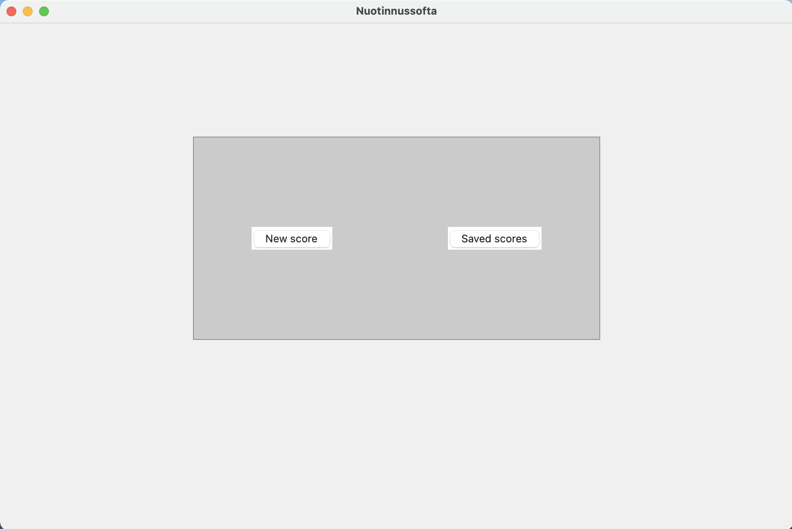

# Käyttöohje

Lataa viimeisin [release](https://github.com/yuzamonkey/ot-harjoitustyo/releases) _Assets_-osion alta _Source code_

## Ohjelman käynnistäminen
Ennen ohjelman käynnistämistä, asenna riippuvuudet komennolla:

```bash
poetry install
```

Jonka jälkeen suorita tarvittavien kansioiden asennus komennolla:

```bash
poetry run invoke build
```

Ohjelma käynnistyy komennolla:

```
poetry run invoke start
```

## Aloitusnäkymä

Sovellus käynnistyy aloitusnäkymään. Aloitusnäkymästä voi avata uuden tiedoston (New score) tai hallita tallennettuja tiedostoja (Saved Scores)



Aloitusnäkymään pääsee takaisin _Tools_-valikon alta painamalla _Show startup_ nappulaa

### Uuden tiedoston luonti

New score-nappulan painaminen vie näkymään, jossa nuottia voi editoida.

### Tallennettujen tiedostojen hallinta

Saved scores-nappula vie näkymään, jossa käyttäjä voi avata tai poistaa tallennetun tiedoston

## Nuotin editointi

Työkalut nuotin editointia varten löytyvät yläpalkin _Notation_, _Signatures_ ja _Tools_ valintojen alta.

_Notation_ vastaa tahtien ja nuottiarvojen lisäyksestä ja poistosta. _Signatures_ alta löytyy valinnat avaimen, sävel- tai tahtilajin- vaihtoon. _Tools_ sisältää playback-valinnat, tempon ja nimen vaihdon, sekä tiedostohallinnan.

### Nuottiarvojen lisääminen ja poistaminen

### Tiedoston nimen vaihtaminen

### Playback

### Muut arvot

### Tiedoston tallennus


