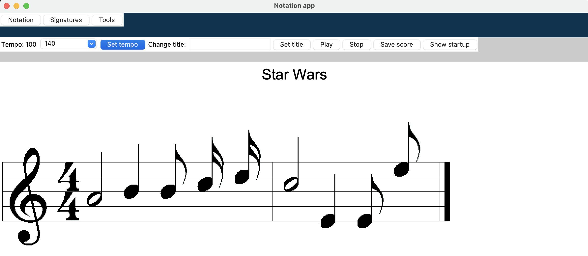

# Käyttöohje

Lataa viimeisin [release](https://github.com/yuzamonkey/ot-harjoitustyo/releases) _Assets_-osion alta _Source code_

## Ohjelman käynnistäminen
Ennen ohjelman käynnistämistä, asenna riippuvuudet komennolla:

```bash
poetry install
```

Jonka jälkeen suorita tarvittavien kansioiden asennus komennolla:

```bash
poetry run invoke build
```

Ohjelma käynnistyy komennolla:

```
poetry run invoke start
```

## Aloitusnäkymä

Sovellus käynnistyy aloitusnäkymään. Aloitusnäkymästä voi avata uuden tiedoston (New score) tai hallita tallennettuja tiedostoja (Saved Scores)


Aloitusnäkymään pääsee takaisin _Tools_-valikon alta painamalla _Show startup_ nappulaa

### Uuden tiedoston luonti

New score-nappulan painaminen vie näkymään, jossa nuottia voi editoida.


### Tallennettujen tiedostojen hallinta

Saved scores-nappula vie näkymään, jossa käyttäjä voi avata tai poistaa tallennetun tiedoston


## Nuotin editointi

Työkalut nuotin editointia varten löytyvät yläpalkin _Notation_, _Signatures_ ja _Tools_ valintojen alta.


_Notation_ vastaa tahtien ja nuottiarvojen lisäyksestä ja poistosta. _Signatures_ alta löytyy valinnat avaimen, sävel- tai tahtilajin- vaihtoon. _Tools_ sisältää playback-valinnat, tempon ja nimen vaihdon, sekä tiedostohallinnan.

### Nuottiarvojen lisääminen ja poistaminen

Klikkaamalla _Notation_ alla olevaa _Add note_-nappulaa käyttäjälle näkyy valinnat nuotin lisäämiseen. _Add_ lisää nuotin, kun käyttäjä on valinnut haluamansa arvot. _Add rest_ toimii samalla tavalla taukoihin.


Klikkaamalla _Notation_ alla olevaa _Remove notation_-nappulaa käyttäjä voi poistaa lisäämänsä nuotin tai tauon. Alla olevassa kuvassa 'M2' tarkoittaa tahtia 2 (measure 2), N4 tarkoittaa neljättä nuotinnosta (notation 4).


Tahteja voi lisätä loppuun ja poistaa lopusta _Add measure_ ja _Remove last measure_ nappuloista.

### Nuottiavaimen, sävellajin ja tahtilajin vaihtaminen

Valinnat nuottiavaimen, sävellajin ja tahtilajin vaihtoon löytyy _Signatures_ valinnan alta.

### Tempon muuttaminen

Tempoa voi vaihtaa _Tools_ alta valitsemalla tempon valikosta ja klikkaamalla _Set tempo_ painiketta. Tempo vaikuttaa playbackin nopeuteen.



### Tiedoston nimen vaihtaminen

_Tools_ alta voi vaihtaa tiedoston nimen syöttämällä _Change title:_ kenttään haluamansa nimen ja klikkaamalla _Set title_.


### Playback

_Tools_ alta löytyy nappulat _Play_ ja _Stop_. _Play_ soittaa kirjoitetun sävellyksen, _Stop_ lopettaa soiton.

### Tiedoston tallennus ja poisto

_Tools_ alta nappula _Save score_ tallentaa kirjoitetun tiedoston. Tiedoston voi avata tai poistaa menemällä aloitusnäkymään klikkaamalla _Show startup_, valitsemalla _Saved scores_. _Open_ avaa tiedoston editoitavaksi, _Delete_ poistaa tiedoston.

Jos tallennettaessa samanniminen tiedosto on jo olemassa, vanha tiedosto ylikirjoitetaan. Uusi tiedoston nimi ei korvaa vanhaa tallennettua tiedostoa.
