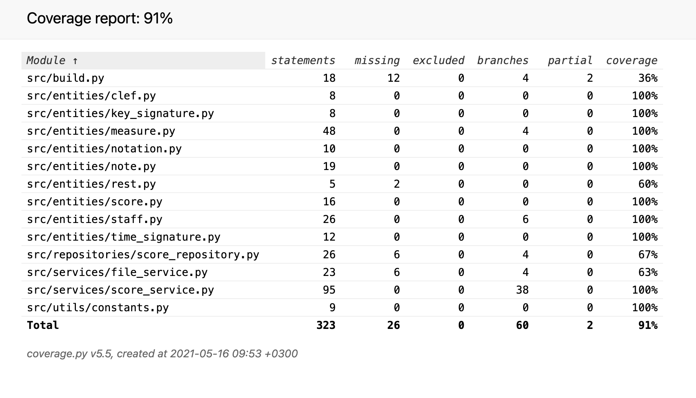

# Testausdokumentti

Yksikkö- ja integraatiotestit on toteutettu unittestilla ja manuaaliset testit järjestelmätasolla

## Yksikkö- ja integraatiotestaus

### Sovelluslogiikka

Sovelluslogiikan luokkia FileService ja ScoreService testataan TestFileService ja TestScoreService-testiluokilla. Testejä varten ei ole erillistä muistia, vaan testitiedostot tallentuvat samaan hakemistoon kuin muut tiedostot.

### Repositorio-luokat

Repositorio-luokkaa ScoreRepository testataan TestScoreRepository-luokassa

### Testauskattavuus

Käyttöliittymäkerrosta lukuunottamatta sovelluksen testauksen haarautumakattavuus on 91%

Tiedostoa build.py ei ole testattu erikseen

## Järjestelmätestaus

Järjestelmätestaus on suoritettu manuaalisesti

### Asennus ja konfigurointi

Sovellus on haettu ja sitä on testattu käyttöohjeen kuvaamalla tavalla macOS- ja Linux-ympäristöissä.

Sovellusta on testattu ilman käyttöohjeessa mainittua `build` komentoa. Sovelluksen testaus aiheuttaa kuitenkin kyseisen komennon suorittamisen, jotta testit menevät läpi.

### Toiminnallisuudet

Kaikki [määrittelydokumentin](./vaatimusmaarittely.md) ja [käyttöohjeen](./kayttoohje.md) listaamat toiminnallisuudet on käyty läpi. Sovelluksesta ei ole löytynyt bugeja, jotka voisivat aiheutua käyttäjän syöttämistä virheellisistä arvoista.

## Sovellukseen jääneet laatuongelmat

Nuotin muokkaaminen aiheuttaa usein vaakasuoran scrollin paikan vaihtumisen. Scrollin paikka ei kuitenkaan ole täydellisesti optimoitu, jolloin jotkin muutokset nuotissa voivat siirtää nuottikuvaa epäluontevaan paikkaan.
